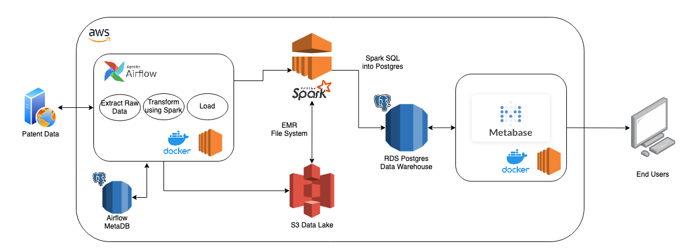

# patent-pipeline

## Purpose

Build a pipeline to analyze open patent data from US Patent and Trademark Office.

## Data

Data is collected from PatentsView API (https://api.patentsview.org/doc.html), which is "intended to inspire the exploration and enhanced understanding of US intellectual property (IP) and innovation systems."

## System Architecture Diagram

## Resources
This project has the following key dependencies:

| Dependency Name | Documentation                | Description                                                                            |
|-----------------|------------------------------|----------------------------------------------------------------------------------------|
| Docker        | https://www.docker.com/ | We help developers and development teams build and ship apps |
| Airflow        | https://airflow.apache.org/ | A platform created by the community to programmatically author, schedule and monitor workflows |
| Spark        | https://spark.apache.org/ | A unified analytics engine for large-scale data processing |
| AWS S3        | https://aws.amazon.com/s3/ | Object storage built to store and retrieve any amount of data from anywhere |
| AWS EMR        | https://aws.amazon.com/emr/ | Easily run and scale Apache Spark, Hive, Presto, and other big data frameworks  |
| AWS RDS        | https://aws.amazon.com/rds/ | Set up, operate, and scale a relational database in the cloud with just a few clicks |
| AWS EC2        | https://aws.amazon.com/ec2 | Secure and resizable compute capacity to support virtually any workload |
| Metabase        | https://www.metabase.com/ | Meet the easy, open source way for everyone in your company to ask questions and learn from data. |

## To Do
- Host Metabase instance on AWS EC2 to access publicly
- Provision AWS Elastic Beanstalk to handle load balancing
- Add Entity Relationship Diagram

